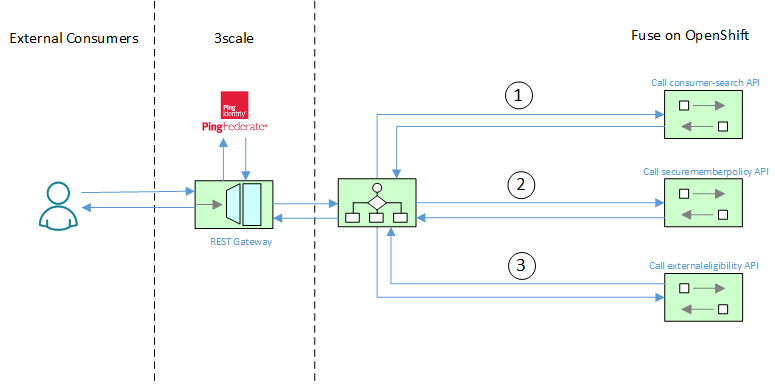
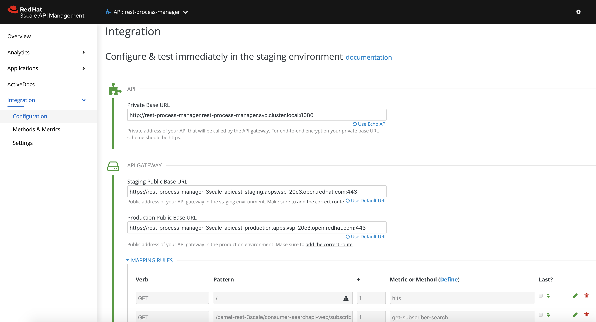
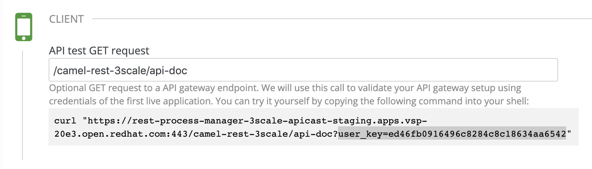
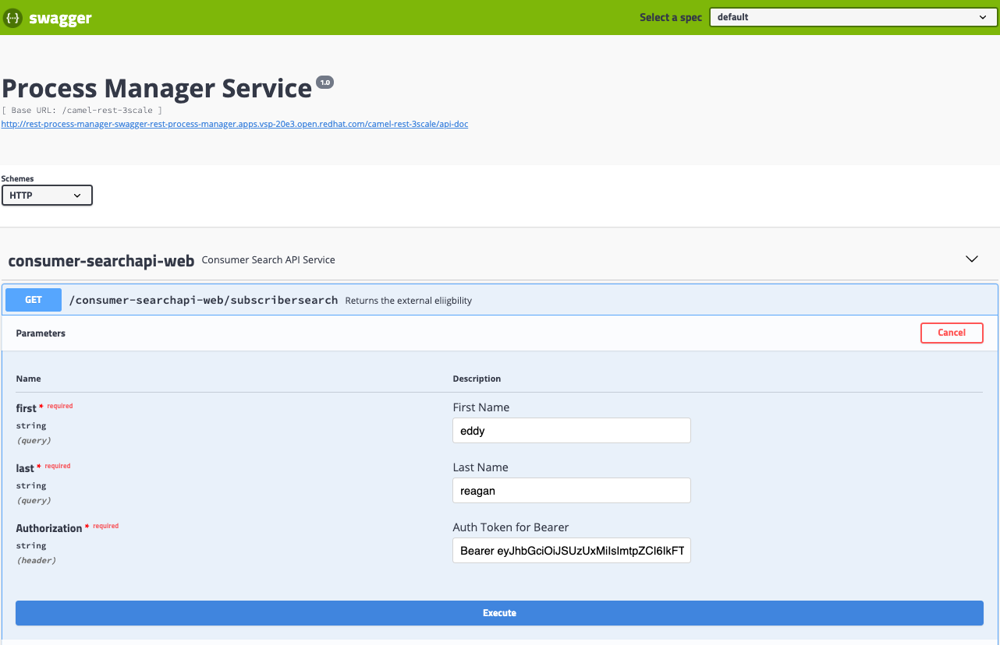
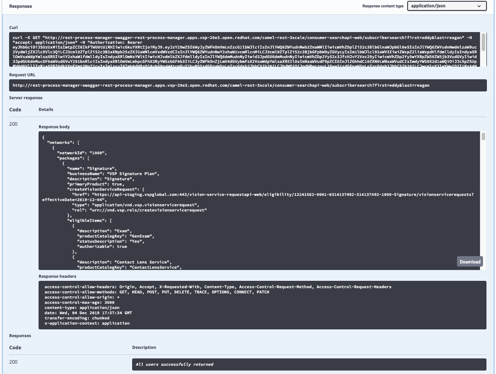

RESTful Process Manager in Fuse 7.5
====================================

This project demonstrates a RESTful Process Manager which gathers responses from multiple API's and returns them to the Requestor.  It is not a composite API, as the 3 payloads aren't combined into a single response.  Instead, only the final payload is returned to the Requestor. This service is implemented in Apache Camel using Red Hat Fuse 7.5, and front-ended using Red Hat 3scale.  Below is a diagram illustrating the flow between 3scale and Fuse, demonstrating both the Process Manager and Request-Response EIP's.



## Prerequisites

- VSCode 1.4+
- OpenShift 3.11+
- Fuse 7.5 Image Streams (template found [here](https://raw.githubusercontent.com/jboss-fuse/application-templates/master/fis-image-streams.json))

## Deployment

This project can be deployed using two methods:

* Standalone Spring-Boot container
* On an Openshift 3.11+ environment using Fuse 7.5.

## Standalone Spring Boot Container

The standalone method takes advantage of the [Camel Spring Boot Plugin](http://camel.apache.org/spring-boot.html) to build and run the microservice.

Execute the following command from the root project directory:

```
mvn spring-boot:run -Dspring.profiles.active=dev
```

It's also possible to navigate to the REST service using the Swagger / OpenAPI documentation [here](http://localhost:8080/swagger-ui.html).

## Openshift Deployment

First, create a new OpenShift project called *rest-process-manager*

```
oc new-project rest-process-manager --description="Fuse REST Process Manager Demo" --display-name="REST Process Manager"
```

Execute the following command which will execute the *openshift* profile that executes the `clean fabric8:deploy` maven goal:

```
mvn -Popenshift
```

The fabric8 maven plugin will perform the following actions:

* Compiles and packages the Java artifact
* Creates the OpenShift API objects
* Starts a Source to Image (S2I) binary build using the previously packaged artifact
* Deploys the application using binary streams

## Expose the route via 3scale

As default, 3scale is installed and configured with SmartDiscovery enabled.  As a result, we need to expose our Fuse (Camel) RESTful service using 3scale.  Once the container is deployed, open 3scale and discover the new Fuse integration by clicking on *New API* and selecting *Import from OpenShift*.  

Enter the details for the new route as shown below:



For the client test portion, be sure to setup an Application Plan, Publish then assign it to your Developer user.  This way, an API Key will be generated.  This is what the Client Test screen should look like:



## Swagger UI

A [Swagger User Interface](http://swagger.io/swagger-ui/) is available within the rest-process-manager application to view and invoke the available services.  Click the above route location (link), and append `/swagger-ui.html` when the page opens.  This should display the below Swagger interface:

The raw swagger definition can also be found at the context path `/camel-rest-3scale/api-doc`.  The swagger UI request window is illustrated by the following:



Finally, the response screen is below:



## Command Line Testing

Using a command line, execute the following to query the definition service

```
curl -X GET \
  'https://rest-process-manager-3scale-apicast-staging.apps.open.redhat.com:443/camel-rest-3scale/consumer-searchapi-web/subscribersearch?first=eddy&last=reagan&user_key=<enter 3scale userkey>' \
  -H 'Accept: */*' \
  -H 'Accept-Encoding: gzip, deflate' \
  -H 'Authorization: Bearer <insert auth token from above>'
```

A successful response will output the following

```json
{"networks": [{
   "networkId": "1000",
   "packages":    [
            {
         "name": "Signature",
```
...